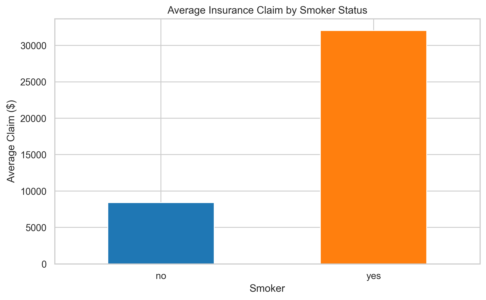
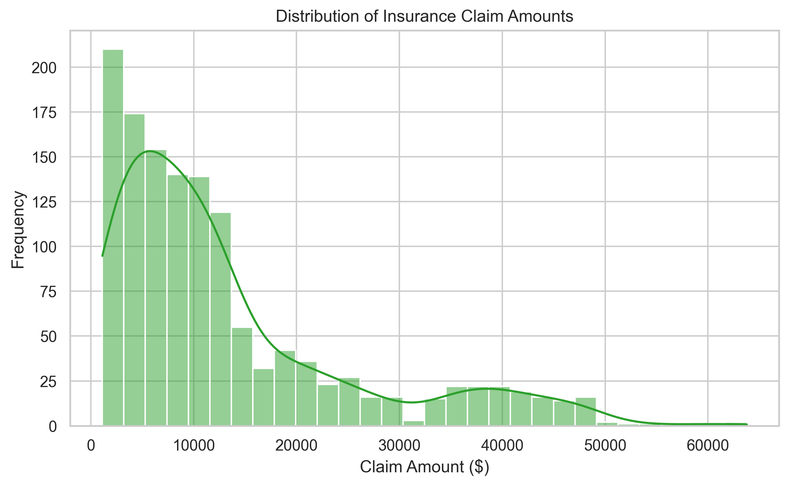
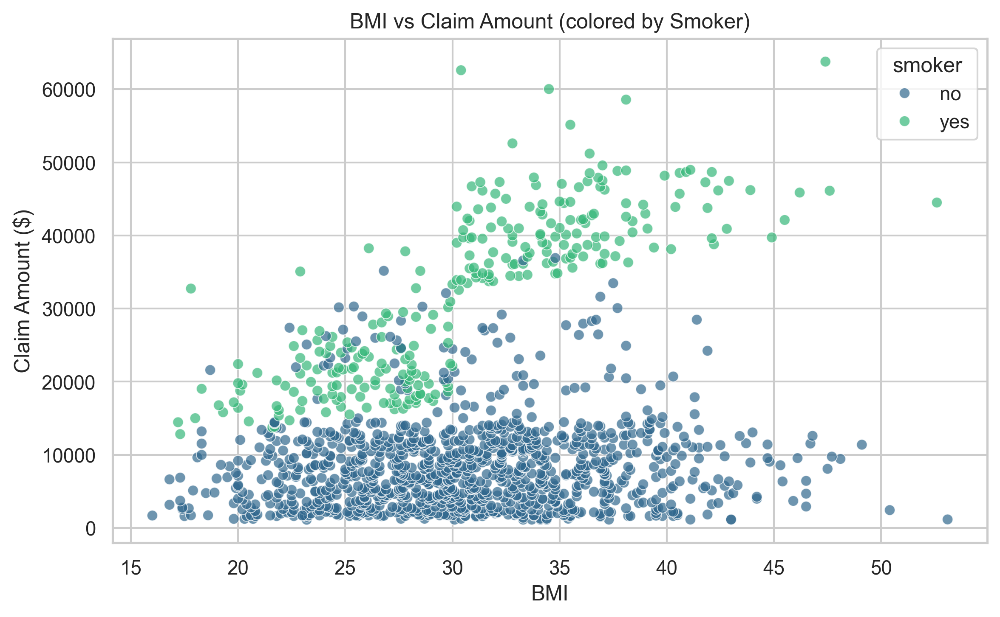

# Healthcare Insurance Claims Analysis

## Overview
Exploratory data analysis on a synthetic insurance claims dataset to identify factors influencing claim amounts.

## Dataset
- Source: Kaggle (Medical Insurance Claims)
- Original rows/columns: 1340 rows, 11 columns
- Target: `claim` (insurance cost)

## Cleaning Steps
- Dropped unnecessary ID columns (`index`, `PatientID`)
- Filled missing values:
  - `age` (5 missing) → median
  - `region` (3 missing) → mode (most common value)
- Standardized categorical columns (lowercase, stripped whitespace)
- Converted `age` to integer
- No duplicates found
- Kept outliers (realistic in insurance data — e.g., high claims)

## Key Findings
- Smokers pay **~280.6% more** on average than non-smokers ($32,050 vs $8,421)
- Average claim by gender: Male $13,920, Female $12,570
- Average claim by region: Northeast highest (~$16,889), Northwest lowest (~$11,672)
- BMI nearly identical across diabetic status (~30.4–30.9)

## Visualizations

## Tools Used
- Python 3
- Pandas (data cleaning & EDA)
- Matplotlib & Seaborn (visualization)
- Jupyter Notebook in VS Code

## Next Steps / Future Work
- Predictive modeling (e.g., regression to predict claim amount)
- Interactive dashboard in Power BI or Microsoft Fabric
- Deploy as web app (e.g., Streamlit or Flask)

Built as part of portfolio for data analyst / data engineer roles.  
Feedback welcome!
